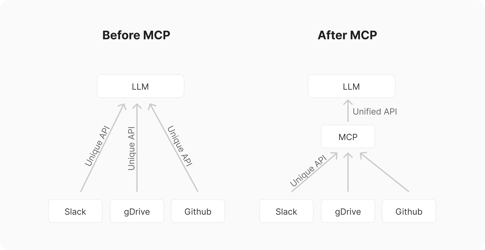
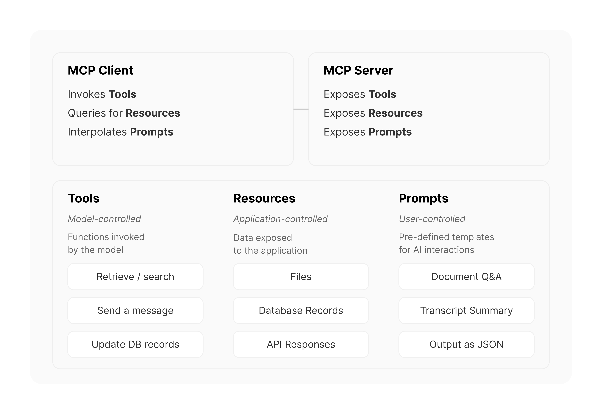
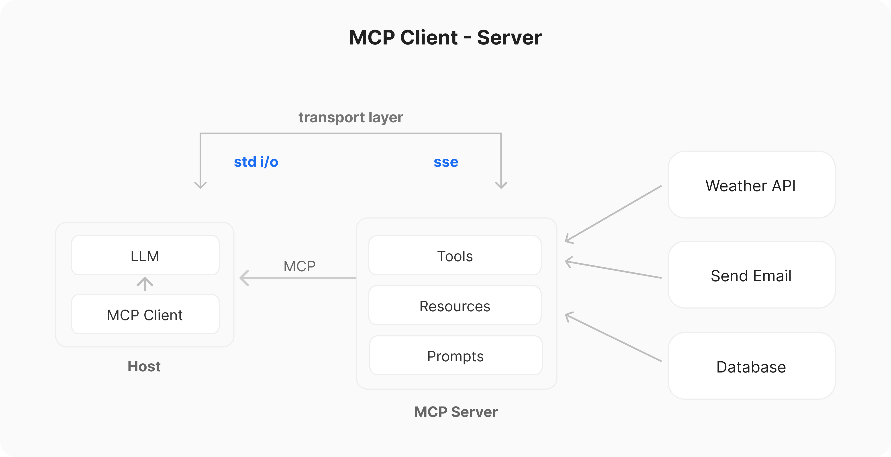

# MCP

## Model Context Protocol overview

MCP (Model Context Protocol) can be understood as a "universal language" for communication between AI and external tools. It's like a translator, allowing different AI applications (such as chatbots, code assistants) and different tools (like databases, GitHub, calendars) to easily communicate without needing to develop a new interface every time.

## Why is MCP needed?

In the past, if you wanted an AI assistant to access different tools, like a calendar, email, or task manager, you would need to develop a separate interface for each tool (function calling), which resulted in a huge amount of work (N AI applications × M tools = N×M interfaces).   
MCP simplifies everything: all AI applications only need to support MCP, and all tools only need to support MCP. This way, they can communicate with each other, reducing development costs (N+M interfaces).

The current components of MCP servers include:

## How does MCP work?

## Example:

Suppose you're using an AI assistant to manage your work, and it wants to help you schedule today's meeting:

- Without MCP, developers would need to write separate integration code for Outlook, Google Calendar, and Apple Calendar.
- With MCP, the AI only needs to call the MCP server, which will automatically interface with your calendar system. No matter which calendar service you use, the AI can work seamlessly.

## Core Functions of MCP:

- Reducing development costs (no need to develop separate integrations for each tool).

- Enhancing AI's ability to access external data (allowing AI to easily query and manipulate external data).

- Standardizing communication (making communication between different AI applications and tools smoother).   

You can think of MCP as the "USB interface for AI"—any AI device can plug into different tools without needing to individually adapt to each one!
